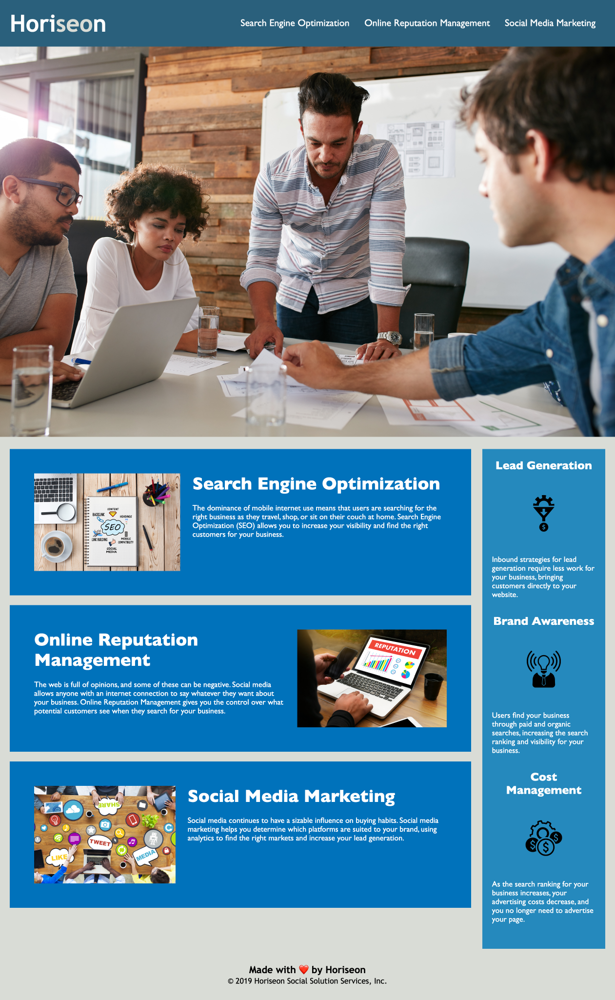

# Code Refactor

## Deployed Link
[Horiseon](https://missatrox44.github.io/code-refactor/)

## Description
This webpage was refactored to meet the following accessibility standards:

* Source code has semantic HTML elements
* The elements follow a logical structure independent of styling and positioning
* Accessible alt attributes are included
* Heading attributes fall in sequential order
* Title elements have concise, descriptive title

## Site Preview 

## Contributing
[Sara Baqla](https://github.com/missatrox44)  
Code review by fellow UT Bootcamp peers including:  
[Chelsea Sexton](https://github.com/chelsea314) 
[Brian Lalli](https://github.com/BrianLalli) 
 Adam Wagh 
[Angel Meza](https://github.com/amezabla)  
 [Andrew Edwards](https://github.com/Andrew87E)  
 [Jeffrey Littleton](https://github.com/littletonjeffrey)

## Questions
Github username: [missatrox44](https://github.com/missatrox44) 
Email: missatrox44@gmail.com
